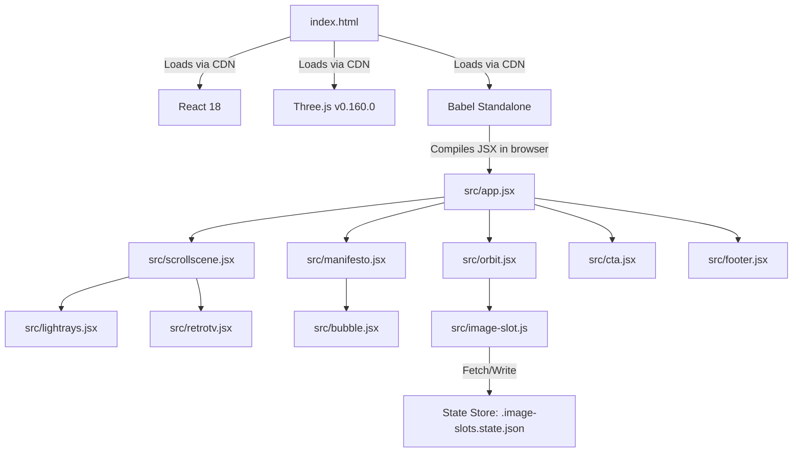

# Technical Architecture & Component Specifications

This document outlines the software architecture, component relationships, state management, and mathematical details of the WebGL shaders and scroll physics that power the Pellucid Frames website.

---

## Technical Architecture Overview

The site is built as a highly performant **single-page React application** that requires **no build step** for local development.



### Script Execution & CDNs
1. **React & ReactDOM (v18.3.1):** Development builds are pulled from the `unpkg` CDN.
2. **Three.js (v0.160.0):** Used for managing WebGL contexts, ortho-cameras, custom shaders, and resizing observers.
3. **Babel Standalone (v7.29.0):** Compiles local `.jsx` files on page load. Component scripts are loaded with `type="text/babel"`.
4. **Registration:** Components attach themselves to the global window object (e.g., `Object.assign(window, { Intro })`), allowing other files to reference them directly.

---

## State Management & File Persistence

### Custom Component: `<image-slot>`
The project includes a custom custom element (`src/image-slot.js`) that allows designers and users to drag and drop images directly into the layout.

- **Drag-and-Drop Ingest:** Accepts `.png`, `.jpg`, `.webp`, `.avif` files. Encodes them using an HTML5 Canvas to downscale the image to a maximum dimension of `1200px` (WebP format, `0.85` quality) to save storage.
- **Reframe Crop Mode:** Double-clicking an active slot triggers reframe mode. Panning and aspect-locked corner resizing adjust relative offset values `s` (scale), `x` (horizontal displacement %), and `y` (vertical displacement %).
- **State File (`.image-slots.state.json`):** The component attempts to read from and write to this local JSON sidecar. Writes are serialized and dispatched to the browser's `window.omelette` workspace filesystem interface, allowing local layouts to survive page reloads and be included in zip packages or exports.

---

## Detailed Component Specifications

### 1. `src/app.jsx`
- **Nav:** Detects scroll displacement (> 40px) to transition the header from transparent to a blur-backed bar (`.nav-solid`).
- **ScrollNav:** Renders vertical indicator dots on the screen. Tracks active sections (`top`, `intro`, `passage`) using an `IntersectionObserver` configured with a `-45% 0px` root margin to capture center-screen transitions.

### 2. `src/intro.jsx`
- **Cinematic Timeline:** Orchestrates a sequenced power-on animation using a state timeline:
  ```javascript
  const PF_INTRO_SEQ = [
    ["count3", 0],     // 3-2-1 Countdown leader
    ["count2", 850],
    ["count1", 1700],
    ["hands", 2550],    // Logo side-wings slide in from sides
    ["symbol", 3450],   // Center lens symbol rotates in
    ["assembled", 4250],// Emblems lock together
    ["zoom", 4650],     // Scales 7.2x into the symbol's center square
    ["poweron", 5550],  // Retro TV screen bloom sequence
    ["fade", 6450],     // Intro container fades
    ["done", 7150]      // Render main site
  ]
  ```
- **Accessibility:** Detects user reduced motion settings to bypass the intro sequence entirely. Pressing `Escape`, `Space`, or `Enter` skips the animation.

### 3. `src/scrollscene.jsx`
Manages the viewport-locked scroll animation container.
- **Cubes Array (`PF_CUBES`):** Seeded random configuration of 18 3D cubes.
- **requestAnimationFrame Loop:** Reads the bounding client rect of the scroll track and computes scroll completion fraction $p \in [0,1]$:
  $$p = \text{clamp}\left(\frac{-\text{rect.top}}{\text{trackHeight} - \text{viewportHeight}}, 0, 1\right)$$
- **Animation calculations per frame:**
  - **TV Zoom:** Scales exponentially based on scroll progress: $\text{scale} = 1 + 6.5 \cdot p^2$.
  - **Cubes Velocity:** Travel along polar angles using a cubic ease-out curve to blast outward radially toward the camera.
  - **Video slots:** To assign actual video feeds, URLs can be appended to the `PF_CUBE_VIDEOS` array. Front faces render loop elements, while side faces render solid gradients.

### 4. `src/retrotv.jsx`
- **Tilt Interaction:** Adds a physical 3D tilt effect on mouse movement. Tracks mouse position relative to the element's bounding rect, updating custom properties `--ry` (rotation-y) and `--rx` (rotation-x):
  $$\text{rotation} = \left(\frac{\text{clientCoord} - \text{rectBound}}{\text{rectDimension}} - 0.5\right) \cdot \text{maxDegrees}$$
- **OSD Channel Index:** Tracks active screens (`home`, `toony`, `capital`, `live`, `ott`) mapping to CSS theme classes (`feed-home` to `feed-ott`).
- **Structure Mode:** Overlay showing 16:9 grids and action margins (`SAFE · TITLE`).

### 5. `src/manifesto.jsx`
- **Character Splitting:** Segments the string `"Every Frame Earns Its Place."` into character tokens, tracking a global reveal order.
- **Cascade Reveal:** Each character fades and scales into view dynamically using a staggered viewport percentage check:
  - Orb container scales from `0.12` to `1.0` between $p \in [0.22, 0.62]$.
  - Characters animate between $p \in [0.48, 0.88]$.
  - Subtext fades in between $p \in [0.68, 0.82]$.

### 6. `src/orbit.jsx`
- **Elliptical Offsets:** Lays out showcase items on an SVG ellipse shape.
- **CSS Offset Motion:** Distributes cards evenly along the path using `offsetPath: path("...")`. CSS offset delays are staggered using negative delays based on duration:
  $$\text{delay} = -\left(\frac{i}{\text{total}}\right) \cdot \text{duration}$$
  This creates smooth, continuous orbital rotation without JavaScript positioning calculations.

### 7. `src/cta.jsx`
- **Scroll Text Color Interpolation:** Renders text color shifting from dull grey to paper off-white word-by-word.
- **Linear Interpolation Formula:** Uses scroll progress $p$ to interpolate RGB channels from grey $(74, 74, 74)$ to paper white $(249, 239, 232)$:
  $$\text{channel} = \text{round}(74 + \text{localProgress} \cdot (\text{targetChannel} - 74))$$

---

## WebGL Shader Formulas & Materials

### 1. Volumetric LightRays (`src/lightrays.jsx`)
Features a custom WebGL fragment shader simulating sunbeams passing through a dusty lens:

- **Ray Strength Calculation:** Evaluates strength relative to anchor origin:
  $$\text{strength} = \cos(\theta_{\text{distorted}}) \cdot \text{lengthFalloff} \cdot \text{pulse}$$
- **Angle Distortion:** Adds subtle waves to the light angles:
  $$\theta_{\text{distorted}} = \theta_{\text{cos}} + D \cdot \sin(2.0 \cdot t + d \cdot 0.01) \cdot 0.2$$
  *(where $D$ is distortion factor, $t$ is time, $d$ is vector distance)*.

### 2. Glowing Plasma Orb (`src/bubble.jsx`)
Processes a multi-octave simplex noise shader simulating a fluid plasma bubble:

- **Simplex Noise (`snoise3`):** 3D simplex noise function calculates radial displacement.
- **Hue Shift:** Evaluates YIQ color spaces to rotate color values dynamically by degree parameters:
  $$\begin{bmatrix} Y \\ I' \\ Q' \end{bmatrix} = \begin{bmatrix} Y \\ I\cos(\phi) - Q\sin(\phi) \\ I\sin(\phi) + Q\cos(\phi) \end{bmatrix}$$
- **Alpha Extraction:** Uses the maximum color intensity to compute variable opacity values for a smooth alpha gradient fade.
