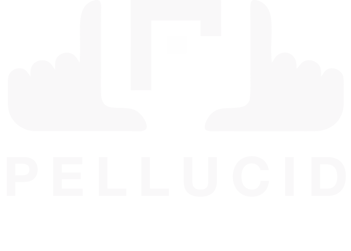

<div align="center">



### High-end video storytelling, on the web.

A cinematic, motion-driven site — WebGL shaders, scroll-choreographed
animation, and a retro-tech aesthetic. Zero build step, zero framework CLI,
runs entirely in the browser.

[](https://react.dev)
[](https://threejs.org)
[](https://babeljs.io)
[]()

</div>

---

## Quick start

No install, no compile — Babel transpiles JSX live in the browser.

```bash
npx http-server -p 8080 -c-1
# or
python3 -m http.server 8080
```

Open **`http://localhost:8080/index.html`**. The `-c-1` flag disables caching,
which matters since nothing here is fingerprinted for cache-busting.

| Page | Entry point |
|---|---|
| Home | [`index.html`](index.html) |
| About | [`about.html`](about.html) |

---

## Design system

Three colors, no exceptions. Sub-tones come from opacity, not new hex values.

<table>
<tr><th>Token</th><th>Swatch</th><th>Value</th><th>Role</th></tr>
<tr><td><code>--ink</code></td><td></td><td><code>#000000</code></td><td>Background / base</td></tr>
<tr><td><code>--paper</code></td><td></td><td><code>#F9EFE8</code></td><td>Text / lines</td></tr>
<tr><td><code>--volt</code></td><td></td><td><code>#FDDA10</code></td><td>Accent / active state</td></tr>
</table>

**Type:** `Geologica` for display and headlines, `JetBrains Mono` for OSD
labels and tech readouts — both via Google Fonts.

Full spec, including sub-tone opacities and component math, lives in
[DESIGN.md](DESIGN.md) and [ARCHITECTURE.md](ARCHITECTURE.md).

---

## How it's built

No bundler, no framework CLI, no Node runtime in production — the whole
stack runs client-side:

- **React 18 + Babel Standalone**, loaded from the unpkg CDN. Every
  `src/*.jsx` file is a `type="text/babel"` script compiled on page load.
- **No ES modules.** Each component attaches itself to `window`
  (`Object.assign(window, { ScrollScene })`) so other components can reach
  it. `index.html` loads scripts in dependency order — `app.jsx` last.
- **Three.js (v0.160.0)** via CDN drives the two WebGL centerpieces: a
  volumetric light-ray shader and a simplex-noise plasma orb.
- **`<image-slot>`**, a vanilla Web Component for drag-and-drop image
  placement with crop/reframe, persisting state to
  `.image-slots.state.json` through a local dev file bridge. In production
  it renders as a plain text label.

### Scroll architecture

[`scrollscene.jsx`](src/scrollscene.jsx) reads a tall track element's
`getBoundingClientRect()` on every animation frame to compute a single
progress value `p ∈ [0, 1]`. Every child animation — TV zoom, cube radial
blast — derives from that one number.
[`manifesto.jsx`](src/manifesto.jsx) and [`cta.jsx`](src/cta.jsx) run the
same pattern independently for their own sections.

---

## Structure

```text
.
├── index.html              home page
├── about.html               about page
├── src/
│   ├── app.jsx               nav, chrome, overlay menu — loads last
│   ├── scrollscene.jsx        scroll-track progress controller
│   ├── lightrays.jsx          WebGL volumetric light-ray shader
│   ├── bubble.jsx              WebGL simplex-noise plasma orb
│   ├── retrotv.jsx             interactive 3D retro television
│   ├── manifesto.jsx           scroll character-split reveal
│   ├── orbit.jsx                elliptical works carousel
│   ├── intro.jsx                 3-2-1 film-countdown intro
│   ├── cta.jsx                    scroll-interpolated call to action
│   ├── footer.jsx                  animated-border footer
│   ├── icons.jsx                    inline Lucide-style icon set
│   ├── image-slot.js                drag/crop custom element
│   └── about.jsx                    about page component
├── css/styles.css           global styles & design tokens
├── assets/                  SVG logos and symbols
├── uploads/                 image & video content
├── DESIGN.md                brand, color, and type spec
├── ARCHITECTURE.md          shader math & scroll physics deep dive
└── CLAUDE.md                agent working instructions
```

---

## Working with images

Slots created via `<image-slot>` (see `src/orbit.jsx`) only accept
drag-and-drop in local dev — production renders their text label instead.

1. Run the local server (above).
2. Drag a `.png` / `.jpg` / `.webp` / `.avif` onto any slot.
3. Double-click a filled slot to reposition and scale.
4. Crop and position persist to `.image-slots.state.json` automatically.

---

## Testing

> **Manual only.** No automated browser testing, screenshots, or DOM
> inspection — verify changes by hand in a real browser.

---

<div align="center">

**[DESIGN.md](DESIGN.md)** · **[ARCHITECTURE.md](ARCHITECTURE.md)** · **[CLAUDE.md](CLAUDE.md)**

</div>
